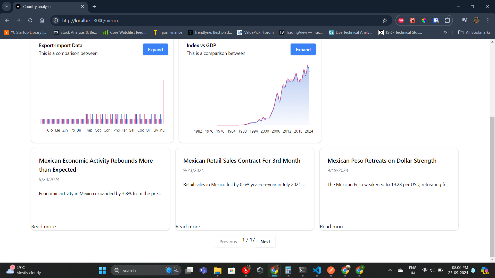

# Trading Economics country analyser

Country Analyser is a powerful web application designed to provide users with comprehensive data for in-depth quantitative analysis. It enables users to easily access and analyze key economic, financial, and statistical news, offering valuable insights for decision-making, forecasting, and trend evaluation.

## Getting Started

### Local setup

Install the dependencies

```bash
npm install
```

Create a .env file in the root folder and add

```bash
BASE_URL=https://api.tradingeconomics.com
KEY=DEVELOPER-KEY
```

Run the development server:

```bash
npm run dev
```

### Docker

Build the image

```bash
docker build -t YOUR_IMAGE_NAME ./path/to/dockerfile
```

Run the container

```bash
docker run -p 3000:3000 -e BASE_URL=https://api.tradingeconomics.com -e KEY=DEVELOPER-KEY YOUR_IMAGE_NAME
```

Open [http://localhost:3000](http://localhost:3000) with your browser to see the result.

1. Search a country

   

2. Country Overview with news

   

   
